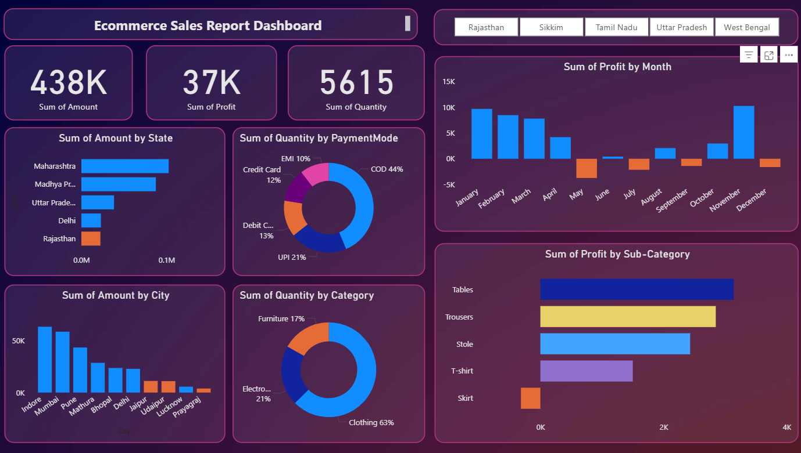

# 🛒 Ecommerce Sales Report Dashboard (Power BI)

### 📅 September 2025  
**Created by:** *Sakshi Birajdar*  
**Tech Stack:** Power BI | DAX | Excel | Data Modeling

---

## 🧩 Problem Statement

In today’s competitive ecommerce market, businesses handle vast amounts of data but often struggle to identify where profits come from, which products drive revenue, and which regions need improvement.  
Manual analysis through spreadsheets is time-consuming and prone to errors, making it difficult for decision-makers to act quickly.

---

## 🎯 Objective

To build an **interactive Power BI dashboard** that provides a 360° view of ecommerce performance — highlighting **sales, profit trends, product performance, customer insights,** and **regional distribution**.  
The goal is to empower management with data-driven insights to optimize operations and marketing strategies.

---

## 💡 Key Insights

| Metric | Insight |
|--------|----------|
| 💰 **Total Sales** | ₹438K across all categories |
| 📈 **Total Profit** | ₹37K net profit |
| 📦 **Total Quantity Sold** | 5615 units |
| 🏙️ **Top States** | Maharashtra, Madhya Pradesh, Uttar Pradesh |
| 🛍️ **Top Categories** | Clothing and Electronics |
| 💳 **Preferred Payment Mode** | COD and Online Payments dominate |

---

## 📊 Dashboard Overview

### ✨ Features:
- 📅 **Monthly sales and profit trend visualization**
- 🌎 **Regional performance map (State-wise and City-wise)**
- 🛒 **Category and Sub-category profit breakdown**
- 💳 **Payment method analysis**
- 📈 **Dynamic filtering for category, state, and time period**
- 🎨 **Dark theme UI for better visual appeal**

---

## ⚙️ Data Modeling and DAX
- Built relationships between **Orders**, **Customers**, and **Products** tables.
- Used **DAX measures** to calculate:
  - Total Sales = `SUM(Sales[Sales Amount])`
  - Total Profit = `SUM(Sales[Profit])`
  - Profit Margin % = `(SUM(Sales[Profit]) / SUM(Sales[Sales Amount])) * 100`
- Created **calculated columns** and **hierarchies** for drill-down analysis.

---

## 🧠 Technologies Used
- **Power BI Desktop** for report creation  
- **Excel/CSV dataset** for raw data  
- **DAX** for custom calculations  
- **Data Modeling** for connecting tables  
- **Power Query** for data cleaning and transformation

---

## 🌐 Live Dashboard (Power BI)
> ⚠️ *Note:* Viewing the live report may require Power BI sign-in.  

🔗 [Click Here to View Live Dashboard](https://app.powerbi.com/reportEmbed?reportId=ff1d8c0a-a75e-44d5-8626-687f00aecd72&autoAuth=true&ctid=2cb2cd12-f37c-4925-afc3-6612bc1db607)

---

## 🗂️ Repository Contents

| File | Description |
|------|--------------|
| `Ecommerce_Sales.pbix` | Complete Power BI report file |
| `dataset/Details.csv` and `dataset/Orders.csv` | Raw datasets used for sales and customer analysis |
| `images/dashboard_preview.png` | Dashboard screenshot |
| `index.html` | Embedded dashboard preview page |
| `README.md` | Full project documentation |

---

## 🚀 How to Use
1. Download the `.pbix` file.  
2. Open it in **Power BI Desktop**.  
3. Refresh data connections if needed.  
4. Explore interactive visuals and filters.

---

## 📈 Business Impact
- Improved decision-making through visual insights.  
- Identified top-performing regions and products.  
- Enabled better marketing and inventory planning.  
- Reduced manual reporting time by 70%.  

---

## 👩‍💻 Author

**Sakshi Birajdar**  
💼 [LinkedIn](https://www.linkedin.com/in/your-linkedin-url)  
📧 sakshibirajdar34@gmail.com  

---

## 🏁 Summary
This project demonstrates the power of **data visualization and analytics** using Power BI.  
It showcases my ability to **clean, model, and visualize data** effectively — turning raw numbers into actionable insights.  
It reflects both **analytical thinking** and **design sense**, crucial for a role in **Data Analytics, Business Intelligence, or Data Science**.
